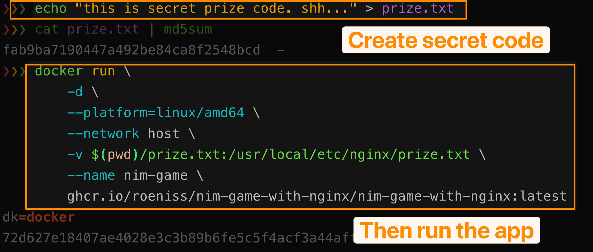
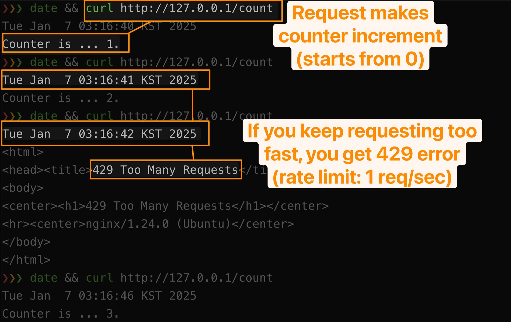
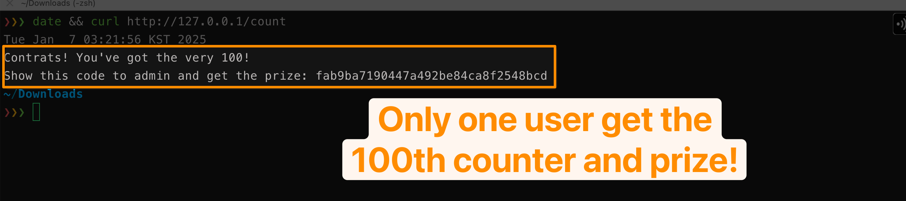

# NIM game with nginx

[한국어](./README.md) | [English](./README-en.md)

nginx 를 이용해 NIM 게임을 만들어 보았습니다.

## 스크린샷

간단하게 게임을 호스팅할 수 있습니다.



요청을 보내면 카운터가 쌓입니다. 너무 빨리 재요청하면 rate limiter 에 걸립니다.



100번째 카운터를 채우는 유저가 승리합니다.




## NIM 게임이란?

한국의 `베스킨라빈스 31`[^1] 게임을 생각하시면 됩니다. 눈치싸움으로 생각하셔도 무방합니다.

정해진 숫자만큼 돌을 가져가다가, 마지막 하나를 가져가는 유저가 승리 또는 패배하는 방식의 게임을 말합니다. (제 게임에서는 승리로 간주합니다)

## 게임 참여 방법

- 각 유저는 curl 명령어로 서버의 카운터를 1씩 증가시킬 수 있습니다.
- 각 유저는 1초 당 한 번 요청을 보낼 수 있습니다 (광클 방지)
- 정확히 100번째 요청을 보낸 유저가 승리합니다.

```sh
curl http://GAME_HOST_IP/count
```

## 게임 시작 방법

```
echo "SECRET_PRIZE_CODE" > prize.txt # create new prize code
cat prize.txt | md5sum # check the md5 hash
docker run -d --platform=linux/amd64 --network host -v $(pwd)/prize.txt:/usr/local/etc/nginx/prize.txt ghcr.io/roeniss/nim-game-with-nginx:latest
```

> [!WARNING]
> 리눅스 도커만 유저의 실제 IP 가 전달됩니다. 다른 플랫폼 (윈도우, macOS) 의 경우, 127.0.0.1 같은 값만 전달되어서 모두의 rate limiter 가 공유됩니다 (사실 이건 이것대로 재밌습니다).

## 구현한 방법

- nginx 로 요청이 들어오면 perl 로 작성된 handler 가 요청을 전달받아 처리하고 클라이언트에게 응답합니다.
  - perl 모듈은 sqlite3 를 사용하여 counter 를 업데이트 합니다.

## Build from source

자동화된 설치 방법은 따로 없지만, 본 레포지토리의 파일들을 참고하여 직접 구성하실 수도 있습니다.

## Inspired by

[Click a Button, Destroy My Site by Hyperplexed (youtube)](https://youtu.be/dRsuD_ygvOc)

[^1]: [https://namu.wiki/w/배스킨라빈스(게임)](https://namu.wiki/w/배스킨라빈스(게임))
